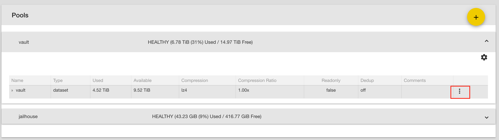
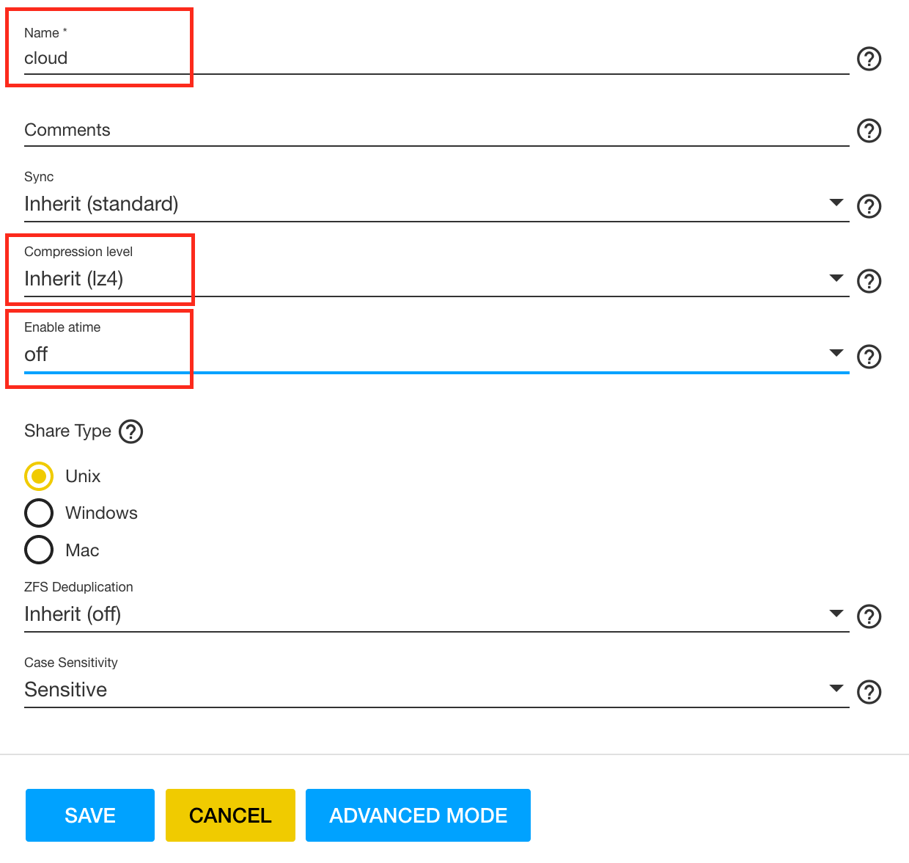
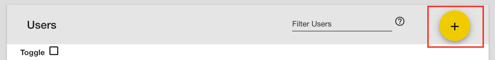
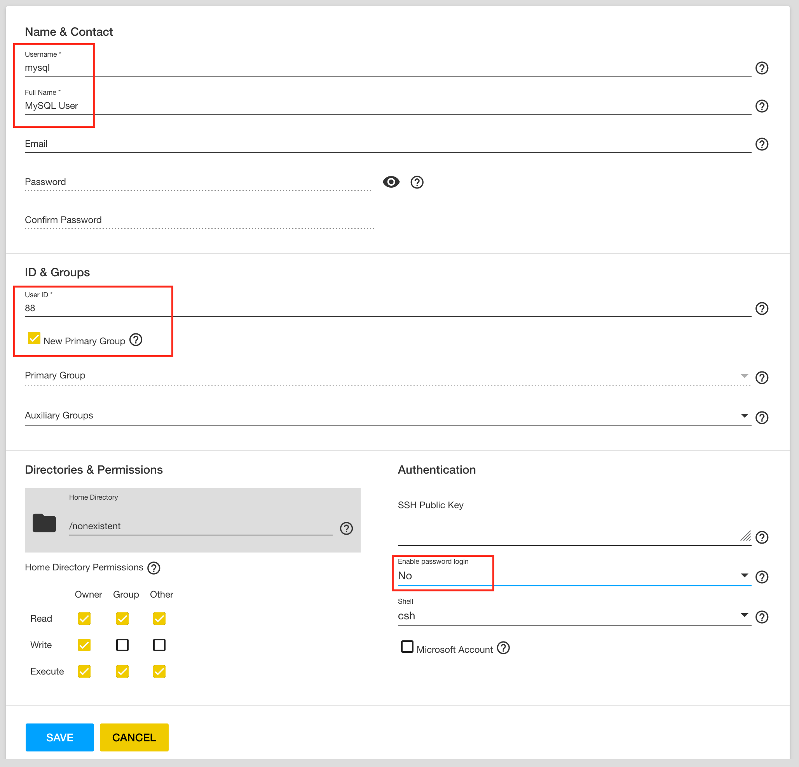
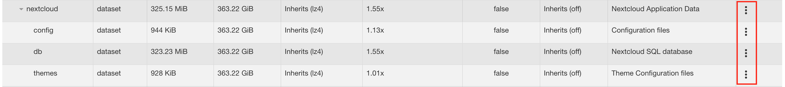
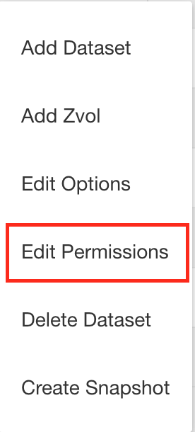
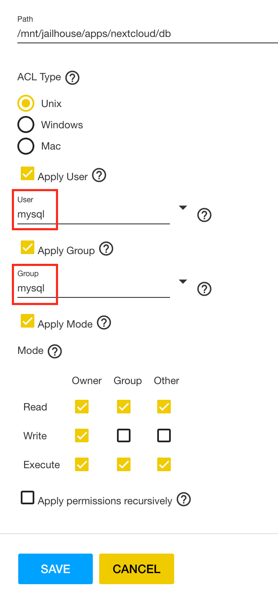
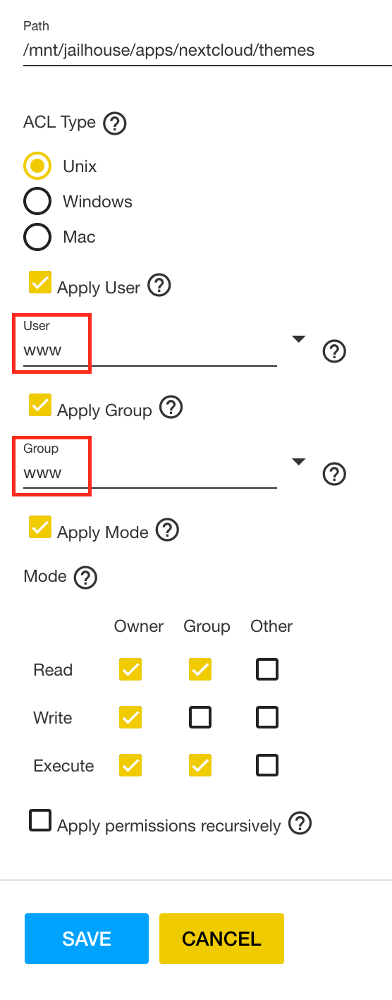
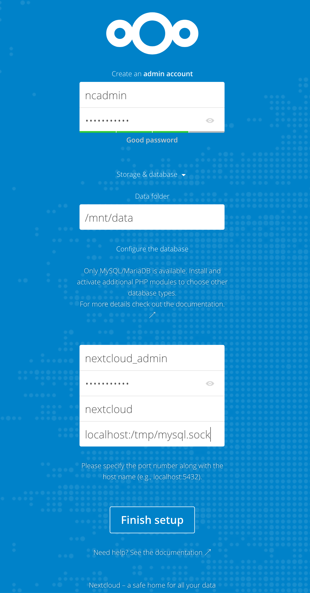
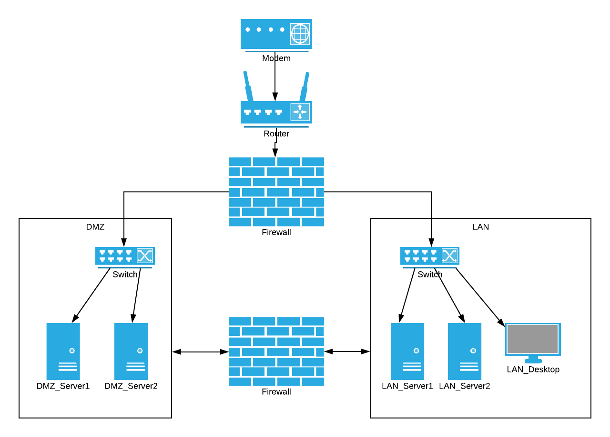

# How to install Nextcloud on FreeNAS in an iocage jail with hardened security

I've recently been through the process of standing up my own personal cloud server, and found that there were a few points of difficulty not directly covered in existing guides on the topic (such as improving security/hardening the server), and a number of the guides on the topic suggested implementing bad practices, such as the use of mod_php (I'll be using php-fpm!). My aim here is to be as explicit as possible about the process I followed so that even a relatively new beginner is able to follow them. A lot of this is adapted from [dureal99d's post](https://forums.freenas.org/index.php?threads/how-to-install-nextcloud-13-in-freenas-with-all-checks-passed-updated-to-use-iocage.61934/) on the same topic, who did a great job at explaining the process, however it discussed the installation of Nextcloud 13, and the certificate installation process was unsuccessful for me so my thought is to share my learnings to save the next person the trouble. The target audience for this guide is the person with very little exposure to the command line in either Linux or FreeBSD. With this in mind, my aim is to be complete as possible with the information I provide, and also to provide some context about *why* certain tasks are being undertaken rather than just direction on which commands to run. A disclaimer to this is that I am by no means an expert, and am still learning, so if you spot any errors or have any suggestions please leave a comment below!

One thing I've noticed a lot of people get hung up on is dataset structure, so to be explicit, I'll describe my configuration. I have *two* data pools (Storage > Pools). One, titled "vault", is my primary storage pool, comprised of 6x4TB WD Red drives. The second, "jailhouse", is a 500GB Samsung SSD, and is the pool I store all of my jails on so that they benefit from the faster IO operations an SSD affords. The final dataset structure I have is as follows:

```bash
├── vault
│   └── cloud
└── jailhouse
    ├── apps
    │   ├── nextcloud
    │   │   ├── config
    │   │   ├── themes
    │   │   ├── db
	└── iocage
    	├── ...
    	├── jails
    	│   └── nextcloud
    	└── ...
```


According to the [Nextcloud 14 Manual](https://docs.nextcloud.com/server/14/admin_manual/maintenance/restore.html), there are four things required to restore a Nextcloud installation:
1. The configuration directory
2. The data directory
3. The database
4. The theme directory

Therefore, it makes sense to make this data independent of the jail (more on this later). This means that if for whatever reason your Nextcloud jail has been broken or deleted, you should be able to restore back to your previous configuration with minimal hassle. In the above structure, the 'cloud' directory represents the data directory; this is where all of your files will be stored. It's important that this is on your primary storage pool so that it can grow in size as required. I've stored the remaining data in their own datasets on my jailhouse pool. To organise this, I've created an 'app' dataset which holds a dataset for each jail I create. As can be seen, there is a dataset named 'nextcloud', which then contains 'config', 'themes' and 'db' datasets for the required information.

The remaining dataset is the 'iocage' dataset. This is created automatically when you create a jail, so you don't need to worry about doing anything here, however it is important to note that this is where the local storage for your iocage jails is held. Specifically, in jails > jailname, or in this case jails > nextcloud. A number of other datasets are created within the iocage dataset, however these aren't particularly relevant to this guide, so if you see them and wonder if they're supposed to be there; don't stress, they are.

I'm sure many of you will have organised your datasets differently - that's fine; this has worked well for me, feel free to adopt it, or don't; it will be the context in which I explain this guide though. For those of you who do want to adopt it, and are confused about how to go about it, I'll explain it below. At the time of writing, the current version of FreeNAS is 11.2-RC2. This is an awkward time, as both the new and old user interfaces are present. For longevity, this explanation will be given in terms of the new interface, as this is most likely to be more relevant to new users. If you're using the legacy UI, the steps will be the same, however the buttons will be in different spots.

## Create Your Datasets

### Storage Dataset

On the left navigation bar, select Storage > Pools

Expand your primary storage pool. In the right most column of the resulting table, locate the three dots on the row of your primary storage dataset (vault in my case):



Select "Add Dataset". 
Populate the form with the following:
```
Name: cloud
Compression level: lz4
Enable atime: Off 
```
i.e:



Note that the atime value is set to off, which is different from the default. From the [FreeNAS User Guide](https://www.ixsystems.com/documentation/freenas/11.2/storage.html), disabling atime prevents the production of log traffic while files are being read, and results in significant performance gains, which is desirable for our data folder.

Leave the rest of the values as default and press "Save". This creates the dataset /vault/cloud

### Application Dataset
If you don't already have a folder for your application data, go ahead and create that now. If you don't have a dedicated pool for your jails or an SSD, it's not crucial, so just put this on whatever pool is most appropriate for you. My recommendation would be to maintain the data structure listed earlier however, so have an entirely separate dataset earmarked for this purpose.

Select "Add Dataset". 
Populate the form with the following:
```
Name: apps
Compression level: lz4
Enable atime: On 
```
Note that here, atime is set to the default value of 'on'. It is enabled here because application data is considered less critical as lower performance here won't impact the usability experience materially.

Leave the rest of the values as default and press "Save". In my case, I've placed this on the jailhouse pool and this creates the dataset /jailhouse/apps

### Nextcloud Application Data Dataset

As described previously, select the "apps" dataset and select "Add Dataset"

Populate the form with the following:
```
Name: nextcloud
Compression Level: lz4
Enable atime: On
```
Leave the rest of the values as default and press "Save". This creates the dataset /jailhouse/apps/nextcloud 

### Nextcloud Database Dataset

Select the "apps/nextcloud" dataset and select "Add Dataset"

Populate the form with the following:
```
Name: db
Compression Level: lz4
Enable atime: Off
```
Again, note that in this case atime is off. Leave the rest of the values as default and press "Save". The database will see steady read and write operations, so performance is a factor here. This creates the dataset /jailhouse/apps/nextcloud/db, and will be used to store the nextcloud database

### Nextcloud Configuration Dataset

Select the "apps/nextcloud" dataset and select "Add Dataset"

Populate the form with the following:
```
Name: config
Compression Level: lz4
Enable atime: On
```
Leave the rest of the values as default and press "Save". This creates the dataset /jailhouse/apps/nextcloud/config, and will store configuration settings for Nextcloud

### Nextcloud Themes Dataset

Select the "apps/nextcloud" dataset and select "Add Dataset"

Populate the form with the following:
```
Name: themes
Compression Level: lz4
Enable atime: On
```
Leave the rest of the values as default and press "Save". This creates the dataset /jailhouse/apps/nextcloud/themes


## Create users and set permissions

Navigate to Accounts > Users, and press the big "+" to add a user:



Populate the resulting form as follows:
```	
Username: mysql
Full Name: MySQL User
User ID: 88
New Primary Group: Checked
Enable Password login: No
```


Now press Save. Navigate back to your "apps" dataset: Storage > Pools, and expand jailhouse > apps >nextcloud. To edit the permissions, select the three dots in the rightmost column corresponding to each dataset, and select "Edit Permissions" as shown below:





Now, for each dataset we want to make the following changes:

db dataset:
```
User: mysql
Group: mysql
```


config dataset:
Note that the 'www' user and group should already exist, there is no need to create them.
```
User: www
Group: www
```


themes dataset:
```
User: www
Group: www
```


## Create an iocage jail:

Now it's time to create the jail. This can be done with the web UI, however as the 11.2 releases are relatively new, I haven't had any experience with it. This guide, will therefore present the instructions for the command line interface. First, you'll need to SSH into your FreeNAS host. Instructions on how to configure SSH are available [here](https://www.familybrown.org/dokuwiki/doku.php?id=fester:ssh_setup). The gist of this is that you'll need to enable the SSH service in the FreeNAS UI and configure the public/private key pair for your user, and then make a connection. From a unix terminal (macOS, Linux), this will look like the following, assuming a FreeNAS host local IP of 192.168.0.9:
```bash
$ ssh root@192.168.0.9
```
If you're using Windows, you'll need to use PuTTy or Cygwin. Refer to the guide linked above for more detail. Once you have established a SSH connection, you'll need to use the iocage command to create the jail as follows:
```bash
$ iocage create -n nextcloud -r 11.2-RELEASE ip4_addr="vnet0|192.168.0.10/24" defaultrouter="192.168.0.1" vnet="on" allow_raw_sockets="1" boot="on"
```
To provide some insight as to what this is doing; the -n flag allows the specification of the jail name, in this case "nextcloud", the -r flag specifies the release of *FreeBSD* to be installed in the jail (Note that this version must be the same or lower than your version of FreeNAS. If you're still using 11.1, then you'll need to pass 11.1-RELEASE as a parameter instead; using 11.2-RELEASE will break the jail), ip4_addr is the networking specification - in this case the IP/Mask for the jail (192.168.0.10/24), and the interface to use, vnet0. Set this IP value to something convenient to you on the subnet you wish it to be on - the selection is arbitrary, though if you're new to this, it is advisable for simplicity that you choose an IP on the same subnet as your router. To illustrate this, if your router is 192.168.0.1, then choose an IP of the form 192.168.0.x, where x is a number between 0 and 254. The defaultrouter parameter specifies the router for your network; typically this will be 192.168.0.1 by default, but if it's something else put that here. vnet="on" enables the vnet interface, which is required as we previously specified vnet0 as the interface. allow_raw_sockets="1" enables raw sockets, which enables the use of functions such as ping and traceroute within the jail, and enables interaction with various network subsystems. boot="on" enables the jail to be auto-started at boot time. More detail on all of the parameters that can be used to configure a jail on creation can be found in the [man page for iocage](https://www.freebsd.org/cgi/man.cgi?query=iocage&sektion=8). If the jail doesn't start automatically after issuing this command, start it manually:
```
$ iocage start nextcloud
```

### Add storage to the iocage jail
As I mentioned previously, it's possible to mount a device from one file system into another. This is done by creating an entry in the file system table (fstab) of the receiving file system. More information about [fstab is available here](https://www.freebsd.org/cgi/man.cgi?fstab(5)). In our case, this enables data edited inside the jail to be stored outside the jail, so that if the jail needs to be destroyed or rebuilt, we still have the configuration data we need to get it back to the previous state with minimal effort. This is achieved using the fstab command.

The goal is to mount the datasets you created earlier into the jail, which can be achieved as follows:
```bash
$ iocage fstab -a nextcloud /mnt/vault/cloud /mnt/data nullfs rw 0 0
$ iocage fstab -a nextcloud /mnt/jailhouse/apps/nextcloud/db /var/db/mysql nullfs rw 0 0
$ iocage fstab -a nextcloud /mnt/jailhouse/apps/nextcloud/config /usr/local/www/nextcloud/config nullfs rw 0 0
$ iocage fstab -a nextcloud /mnt/jailhouse/apps/nextcloud/themes /usr/local/www/nextcloud/themes nullfs rw 0 0
```
The format these take are:
```bash
$ iocage fstab -a jailname source_location destination_location nullfs (rw/ro) 0 0
```
where source_location is the dataset location on your freenas host, and destination_location is the mount location within the jail. rw/ro refers to the permissions the jail has for the mounted dataset; rw is read/write and ro is read only. Choose ro if the jail needs to read the data but shouldn't be able to alter it. Obviously, in the case of Nextcloud, we want to give all of these mounts read write access. The -a flag is to *add* an item to the jails fstab file. The -e flag can be used to *edit* an entry once made:
```bash
$ iocage fstab -e nextcloud
```
This will open the fstab file in vi (if you just entered, type :q! enter to quit). If you're not familiar with vi, or prefer not to use it (the commands take some getting used to), this can be changed by using the setenv command with the EDITOR flag:
```bash
$ setenv EDITOR /usr/local/bin/nano
```
This will change the default editor to use the text editor nano for this session. Other alternatives include ee, emacs, vim. Choose one based on your own preferences and what you have installed. I will be using nano as I find it relatively intuitive.


## Set primary cache in FreeNAS UserSpace Shell
```bash
$ zfs set primarycache=metadata jailhouse/apps/nextcloud/db
```
This setting provides some optimisations specific to database storage, and should *only* be applied to your database directory. Since MariaDB has it's own internal cache, it would be a waste of memory to cache the same thing in ZFS as well.

Further reading on the impact of tweaking this setting can be found on PatPro[[1](https://www.patpro.net/blog/index.php/2014/03/09/2617-mysql-on-zfs-on-freebsd/)][[2](https://www.patpro.net/blog/index.php/2014/03/19/2628-zfs-primarycache-all-versus-metadata/)]. TLDR; Only ever set this to 'metadata' for database applications, and 'all' for everything else, otherwise you'll have significant performance degradation.

Okay, now on to configuring the jail!

## Jail Setup

In order to log in to the jail environment, we need to identify the jail ID (JID). This can be determined by executing one of the following equivelant commands (either is fine):
```bash
$ iocage list
$ jls
```
"iocage list" will present a table that looks like the following:
```
+-----+--------------+-------+--------------+----------------+
| JID |     NAME     | STATE |   RELEASE    |      IP4       |
+=====+==============+=======+==============+================+
| 1   | nextcloud    | up    | 11.2-RELEASE | 192.168.0.10   |
+-----+--------------+-------+--------------+----------------+
```
You can see here JID = 1 for the Nextcloud jail. We can use this to enter the jail using the following command:
```bash
$ jexec <JID> <SHELL>
```
For example:
```bash
$ jexec 1 tcsh
```
This will enter jail 1 with the shell tcsh. A range of shell options can be found [here](http://www.tutorialspoint.com/unix/unix-shell.htm). For completeness, the equivelant iocage command would be:
```bash
$ iocage console nextcloud
```
Which may work for you, however at the time of writing I was having issues with the command line text editors with this entry method (they wouldn't display the file being edited), and isn't something I can recommend at this point in time.

Excellent, now you should be at the jail terminal, and we can start setting things up:
```bash
root@nextcloud:~ $
```
Okay, so what we're going to do here is set up what's known as a FAMP stack. This is a derivation of the LAMP stack, which is a popular web server environment configuration. LAMP is an acronym for Linux Apache MySQL PHP. In this case, we're obviously not using Linux, so this becomes the FAMP stack; FreeBSD, Apache, MySQL and PHP. Alright, lets get stuck into it!

### Change pkg repo to latest branch
This is a step I had to do to fix a bug whose patch had not made it to the quarterly release, <strike>however this likely won't be an issue for you unless you're installing Nextcloud 14.0.1 as a fresh install (This is the case at the time of writing - 18/12/2018). There was an issue in which the Nextcloud configuration file did not contain the correct "apps_paths" directives, which was resolved in 14.0.1_1</strike>. This appears to be an issue with the quarterly branch `pkg` and has not been rectified with newer versions of Nextcloud. I've [filed a bug report](https://bugs.freebsd.org/bugzilla/show_bug.cgi?id=236693) so hopefully this will be fixed in the future, however it has not been at the time of writing - 21/03/2019. The changes made here will update the repository to the one updated most frequently. This is good for bug fixes and new features, with the added risk of bugs that have not yet been discovered. For most people, the quarterly release will be sufficient (unless previous bugs mentioned here have not been fixed), but if you're a trailblazer or want the updates soon after they're released, follow these instructions. Open the FreeBSD configuration file
```bash
$ ee /etc/pkg/FreeBSD.conf
```
Replace the line:
```
url: "pkg+http://pkg.FreeBSD.org/${ABI}/quarterly"
```
with:
```
url: "pkg+http://pkg.FreeBSD.org/${ABI}/latest"
```
Save and Exit:
```
Esc
a (leave editor)
a (save changes)
```

### Install required packages

Now that the pkg repository has been updated, we can go ahead and install the necessary packages. The packages we will install are as follows:
- nano: a text editor
- Apache 2.4: the web server to make your next cloud instance visible in the web ui
- MariaDB: The mysql database package
- Nextcloud: the cloud application!
- Redis: caching package

You can install these by running the following commands:
```bash
$ pkg update
$ pkg install nano
$ pkg install apache24
$ sysrc apache24_enable=yes
$ service apache24 start
$ pkg install mariadb102-server
$ sysrc mysql_enable=yes
$ service mysql-server start
$ mysql_secure_installation
```
NOTE: If you get the following error at this point:
```
ERROR 1045 (28000): Access denied for user 'root'@'localhost' (using password: NO)
```
Follow this procedure:
1. Press Ctrl + C to stop the script
2. Enter the following command to stop the mysql server
```bash		
	$ /usr/local/etc/rc.d/mysql-server stop
```
3. Then enter the following command:
```bash
	$ mysqld_safe --skip-grant-tables & 
	$ /usr/local/etc/rc.d/mysql-server start
```
4. Once again stop the script by pressing Ctrl + C
5. Re-run the wizard script
```bash
	$ mysql_secure_installation
```
This should resolve this issue. Provide the following answers to the prompts:
```
Enter current password for root (enter for none):
```
Press enter as there is no password
```
Set root password? [Y/n] y
New password: 
```
Enter a new password of your choice (don't forget it!)
```
Re-enter new password: 
```
Re-enter the password
```
Remove anonymous users? [Y/n] y
Disallow root login remotely? [Y/n] y
Remove test database and access to it? [Y/n] y
Reload privilege tables now? [Y/n] y
```
MariaDB is now configured. At this stage, the installer should have created a user named 'mysql', and a group named 'mysql' within the jail, with UID=88 and GID=88 respectively. You'll recall earlier in the guide, we created a mysql user and group with these UID and GID. It is **imperative** that the UID and GID of the user and group created earlier on the FreeNAS host, and the user and group created during the mysql installation within the jail match. If they don't, you will run into permission issues, so go ahead and change the ID of the user and group on the FreeNAS host if this is the case for you. Time to install Nextcloud:
```bash
$ pkg install nextcloud-php71
```
It is important to note that php 7.1 is approaching end of life at the time of writing. It will still work, it will just no longer receive updates after reaching EOL. With this in mind, it may be worth installing the php 7.2 package; nextcloud-php72. I didn't do extensive testing with this package however, so you may be subject to errors or differences in the setup procedure not addressed in this guide. As a side note, I did also attempt to install the php 7.3 package, which I wasn't able to get working. This may be due to the fact that php 7.3 is still in beta at the time of writing.

If all of these versions are reasonably old at the time of reading, you can search for the available Nextcloud packages by using the following command:
```bash	
$ pkg search nextcloud
```
Install the most relevant version for you. Importantly, this is only a comment on the php version. All of these packages will have the latest version of Nextcloud itself.

Another point of relevance is that here I have chosen to use the package manager "pkg" to install Nextcloud for its simplicity in installation and maintenance. It is important to be aware that the availability of newer releases through the package manager is subject to updates pushed by the packages maintainer, and may lag behind the official releases somewhat (in my experience this has been in the order of a few days to a week). If you're interested in installing Nextcloud manually, refer to [this guide](https://forums.freenas.org/index.php?threads/how-to-install-nextcloud-13-in-freenas-with-all-checks-passed-updated-to-use-iocage.61934/), which uses "wget" to download a zip file from Nextcloud directly. This may have the benefit of allowing you to use the web interface to update your nextcloud installation (I haven't tried, though). If you do decide to go down this path, you'll have to install php separately, which is addressed in the guide.

Now install Redis as follows:
```bash
$ pkg install redis
$ sysrc redis_enable=yes
$ service redis start
```
The function of the previous commands should have been relatively self explanatory. To provide a little more detail, "pkg update" downloads the latest list of packages in the repository, "pkg install" installs a package, "sysrc" adds an item to rc.conf, which in this case ensures that these services start on boot, and "service <service> start" starts a given service.

Now that we have everything we need installed, lets get configuring!

### Configure MySQL

Login to MySQL to create Nextcloud Database and User
```bash
$ mysql -u root -p
```
Enter the password you made for root during the MariaDB 10.1 Setup. Then enter each of the following commands one by one:
```
CREATE DATABASE nextcloud;
CREATE USER 'nextcloud_admin'@'localhost' IDENTIFIED BY 'your-password-here';
GRANT ALL ON nextcloud.* TO 'nextcloud_admin'@'localhost';
FLUSH PRIVILEGES;
exit
```
Where 'your-password-here' is the password you just used to log in to mysql. It's important that you include the semi-colon ';' at the end of each statement. If you don't it won't know when to terminate each command.

### Configure Apache for PHP 7.1 with php-fpm

Many other guides on this and similar topics suggest the use of mod_php to configure apache to handle php files, however [Apache recommends the use of proxy_fcgi and php-fpm above all other recipes](https://wiki.apache.org/httpd/php). This is due to its ability to enable diagnosis of php problems more quickly, and significantly reduce the memory footprint of the httpd server as it can facilitate more scalable threaded MPM's such as event or worker. This is in contrast to mod_php, which poses some difficulty in maintaining a thread-safe php library. If this is not done, child processes are prone to memory leaks which are likely to consume large amounts of RAM and deplete the available system resources. Additionally, [mod_php has certain vulnerabilities](http://akat1.pl/?id=1) that allow uninitialised memory to be turned into executable code. This vulnerability is mitigated by using FastCGI and php-fpm.

php-fpm should have been installed along with php when you installed Nextcloud, so lets go ahead and add it to the startup script (rc.conf) and start the php-fpm service:
```bash
$ sysrc php_fpm_enable=yes
$ service php-fpm start
```
Now lets enable the proxy_fcgi modules. Open the apache config file:
```bash
 $ nano /usr/local/etc/apache24/httpd.conf
```
Search (Ctrl + W) for and uncomment the following two lines (remove the leading '#') to enable fastCGI:
```
LoadModule proxy_module libexec/apache24/mod_proxy.so
LoadModule proxy_fcgi_module libexec/apache24/mod_proxy_fcgi.so
```
Save and quit
```
Ctrl + X
y
enter
```
Now reload apache gracefully:
```bash
$ apachectl graceful
```
This ensures that whenever a php file is loaded, apache will use the php installation to parse the contents (with the appropriate VirtualHost entry, discussed later). Without this, the php file will download without loading - not very useful. For more information and different configuration options available for php-fpm, see the [apache documentation](https://wiki.apache.org/httpd/PHP-FPM).

#### Create a test Virtual Host File

The virtual host file handles the site specific configuration. This will be discussed in more detail later for the nextcloud specific configuration. For now, lets just create a test vhost configuration so we can test our php configuration. Create a new vhost file:
```bash
$ nano /usr/local/etc/apache24/Includes/test.conf
```
Copy and paste the following
```
<VirtualHost *:80>
	DocumentRoot "/usr/local/www/apache24/data"
	ServerName 192.168.0.10
	ProxyPassMatch ^/(.*.php(/.*)?)$ fcgi://127.0.0.1:9000/usr/local/www/apache24/data/$1
	DirectoryIndex /index.php index.php
</VirtualHost>
```
Change the ServerName directive to match the IP you chose for this jail, then Save and Exit (Ctrl + X).

#### Configure php.ini
```bash
$ cd /usr/local/etc
```
Create php.ini by copying the php.ini-production file (a template with production appropriate security configuration) to a new file named php.ini:
```bash
$ cp php.ini-production php.ini
```
Now, edit php.ini:
```bash
$ nano /usr/local/etc/php.ini
```
Use the search command in nano (Ctrl + W) to uncomment and make sure the following parameters have these values. Comments can be removed by deleting the ";" at the beginning of the line:
```
cgi.fix_pathinfo=1
date.timezone=Country/City
```
SEE: http://php.net/manual/en/timezones.php for the timezone relevant to you. an example would be Australia/Sydney
```
post_max_size = 1999M
upload_max_filesize = 1999M
memory_limit = 512M
```
Uncomment and update the following values as well, which provide the php configuration for caching data:
```
opcache.enable=1
opcache.enable_cli=1
opcache.interned_strings_buffer=8
opcache.max_accelerated_files=10000
opcache.memory_consumption=128
opcache.save_comments=1
opcache.revalidate_freq=1
```
Save and Exit:
```
Ctrl + X
Y
ENTER
```
Restart Apache and php-fpm
```bash
$ service php-fpm restart
$ service apache24 restart
```
#### Test the php configuration

Navigate to /usr/local/www/apache24/data:
```bash
$ cd /usr/local/www/apache24/data
$ nano info.php
```
Paste the following into info.php
```php
<?php
phpinfo(); //display all info
?>
```
This is a simple function that will display all php info for testing purposes. Save and exit:
```
Ctrl + X
Y
ENTER
```
Now, open a browser and navigate to http://JAIL_IP/info.php, where JAIL_IP is the IP you gave to this jail when you created it using iocage create, for example http://192.168.0.10/info.php. You should see a page displaying information about your PHP installation. If this works, congratulations! If it doesn't, go back over the previous steps and try to work out where you've gone wrong.

### Nextcloud configuration

#### Configure Apache for Nextcloud

Nextcloud will have been installed to /usr/local/www/nextcloud, which is not the default web root for apache (place where apache looks for index.php). This will need to be changed to the Nextcloud directory so that the Nextcloud web UI can be loaded. You can do this by editing apache's configuration file:
```bash
$ nano /usr/local/etc/apache24/httpd.conf
```
Change the following two lines
```
DocumentRoot "/usr/local/www/apache24/data"
<Directory "/usr/local/www/apache24/data">
```
To
```
DocumentRoot "/usr/local/www/nextcloud"
<Directory "/usr/local/www/nextcloud">
```
Note that if for whatever reason Nexcloud hasn't been installed to /usr/local/www/nextcloud, replace this path with the Nextcloud installation directory relevant to you. This part is variable based on how you install Nextcloud (i.e. if you followed an installation process different to this one). This path is the default as installed by pkg, but some guides suggest placing Nextcloud in /usr/local/www/apache24/data/nextcloud, which, if this is the case for you, this is what you'll have to change the web root to. 

Now enable the .htaccess file within this block. The changes you've just made should yield a block that looks as follows:
```
DocumentRoot "/usr/local/www/nextcloud"
<Directory "/usr/local/www/nextcloud">
    #
    # Possible values for the Options directive are "None", "All",
    # or any combination of:
    #   Indexes Includes FollowSymLinks SymLinksifOwnerMatch ExecCGI MultiViews
    #
    # Note that "MultiViews" must be named *explicitly* --- "Options All"
    # doesn't give it to you.
    #
    # The Options directive is both complicated and important.  Please see
    # http://httpd.apache.org/docs/2.4/mod/core.html#options
    # for more information.
    #
    Options Indexes FollowSymLinks

    #
    # AllowOverride controls what directives may be placed in .htaccess files.
    # It can be "All", "None", or any combination of the keywords:
    #   AllowOverride FileInfo AuthConfig Limit
    #
    AllowOverride None

    #
    # Controls who can get stuff from this server.
    #
    Require all granted
</Directory>
```
To enable the .htaccess file to be used for configuration, change the AllowOverride value to 'all':
```
AllowOverride all
```
Save and Exit (Ctrl + X).

#### Permissions

Ensure the installation folder and data folders have the correct permissions so that you can read and write configuration settings, files, and perform updates.
```bash
chown -R www:www /usr/local/www/nextcloud /mnt/data
```
This command changes the ownership recursively of the specified folder (folder and all sub folders) to user "www" and group "www". The arguments are:
```bash
chown -R user:group /path/to/directory
```

#### Create a VirtualHost definition for Nextcloud

A Virtual Host (or vhost) definition determines how a server processes an incoming request. This is where a range of configuration options for a site can be set, depending on both the IP and port which a request comes through on. A Virtual Host definition begins with the <VirtualHost> directive, which takes both an IP and a port as a parameter. As an example, the following definition processes requests for IP 192.168.0.10 on port 80:
```
<VirtualHost 192.168.0.10:80>
```
For our purposes, we will use a wildcard (`*`) for the IP, which means that our vhost definition will be evaluated for all IPs, but we will specify port 80 specifically, which is the port used for HTTP traffic. There are two types of vhost matching, [IP-based matching and Name-based matching](https://httpd.apache.org/docs/2.4/vhosts/details.html). Because we're accepting all IP addresses in this configuration, we're relying on the ServerName field for Name-based matching. 

For these examples, I'm going to use mydomain.com, and the subdomain cloud.mydomain.com. If for example you're using a DDNS (more on this later), you might replace all instances of cloud.mydomain.com with something like cloud.no-IP.org. Navigate to the apache Includes directory:
```bash
cd /usr/local/etc/apache24/Includes
```
First, lets remove the configuration file we created earlier; we won't need it anymore.
```bash
$ rm /usr/local/etc/apache24/Includes/test.conf
```
Now, create the new site configuration file:
```bash
$ nano cloud.mydomain.com.conf
```
Add the following content to the file:

```
<VirtualHost *:80>
	DocumentRoot "/usr/local/www/nextcloud"
	ServerName cloud.mydomain.com
	<FilesMatch \.php$>
		SetHandler "proxy:fcgi://127.0.0.1:9000/"
	</FilesMatch>
	DirectoryIndex /index.php index.php
</VirtualHost>
```
Remember to replace cloud.mydomain.com with the domain relevant to you. Save and Exit (Ctrl + X). Now, lets discuss what's going on here. The first line, DocumentRoot, defines the "root", or top level directory from which to serve content. This means that using the URL http://cloud.mydomain.com will direct a user to files contained within this path; in this case /usr/local/www/nextcloud. Additionally, subdirectories within the DocumentRoot will be accessible as a path specification to the URL. As an example, lets assume there is a directory /usr/local/www/nextcloud/data, containing a file test.php. This would be accessible from http://cloud.mydomain.com/data/test.php. It's important that the DocumentRoot points to the top level of the Nextcloud installation, as this is where index.php lies, which will present the Nextcloud user interface.

The ServerName is relatively self descriptive - this is the domain name of your server. It's important to note that this name **must have** a valid DNS entry. This means that either this server is available on the Internet, and can be navigated to, *OR* there is a host entry in your routers DNS Resolver to direct queries to this URL to your web server IP. Alternatively, if this server is only going to be available on your local network, you can replace this with your servers local IP, i.e.:
```
ServerName 192.168.0.10
```
To be clear here:

1. If your domain is available on the internet, cloud.mydomain.com must resolve to a public IP
2. If your domain is only available locally, cloud.mydomain.com must resolve to a local IP
3. OR, it must be a local IP.

The next directive, `<FilesMatch>`, matches all files containing .php in the title and assigns the fastCGI proxy module we set up earlier as the handler. This allows us to use php files, and serve php content using php-fpm.

More reading on Virtual Host definitions are available in the apache documentation [[3]](https://httpd.apache.org/docs/2.4/vhosts/name-based.html) [[4]](https://httpd.apache.org/docs/2.4/vhosts/details.html) [[5]](https://httpd.apache.org/docs/2.4/vhosts/examples.html).

#### Test your configuration
Restart apache:
```
$ service apache24 restart
```
Now, navigate to http://JAIL_IP/, i.e. http://192.168.0.10/ again to confirm you can see the setup screen for Nextcloud. If you can, well done! We're most of the way there.

#### Web Configuration

Set up your admin account with a username and password you choose, then populate the fields as follows:
```
Data folder = /mnt/data
Database user = nextcloud_admin
Database password = MADEUP_PASSWORD_FROM_BEFORE
Database name = nextcloud
Database host = localhost:/tmp/mysql.sock
```


#### Add external domain as a trusted domain

In the terminal, navigate to the Nextcloud config file:

```bash
$ nano /usr/local/www/nextcloud/config/config.php
```

Add your domain name to the trusted domains array. Adding cloud.mydomain.com would look like the following:
```php
<?php
$CONFIG = array (
  'apps_paths' =>
  array (
    0 =>
    array (
      'path' => '/usr/local/www/nextcloud/apps',
      'url' => '/apps',
      'writable' => true,
    ),
    1 =>
    array (
      'path' => '/usr/local/www/nextcloud/apps-pkg',
      'url' => '/apps-pkg',
      'writable' => false,
    ),
  ),
  'logfile' => '/var/log/nextcloud/nextcloud.log',
  'memcache.local' => '\OC\Memcache\APCu',
  'instanceid' => 'ocy4qsadkxhl',
  'passwordsalt' => '44RcdZYDK/TNVGLyCxVPT67M88sjhJ',
  'secret' => 'aCLhfzgCaLGyfVp5upS4mXpP2sduzZw6FGsAZtUwhpduUZji',
  'trusted_domains' =>
  array (
    0 => '192.168.0.10',
    1 => 'cloud.mydomain.com',
  ),
  'datadirectory' => '/mnt/data',
  'dbtype' => 'mysql',
  'version' => '14.0.4.2',
  'overwrite.cli.url' => 'http://192.168.0.10',
  'dbname' => 'nextcloud',
  'dbhost' => 'localhost:/tmp/mysql.sock',
  'dbport' => '',
  'dbtableprefix' => 'oc_',
  'mysql.utf8mb4' => true,
  'dbuser' => 'nextcloud_admin',
  'dbpassword' => 'Default123!',
  'installed' => true,
);
```

The line of interest here is 
```php
1 => 'cloud.mydomain.com',
```
within the `trusted_domains` block. Replace this with your domain. Save and Exit (Ctrl + X).

#### Fix the annoying apache errors

To get rid of the following error message when starting and stopping the apache server:
```
AH00558: httpd: Could not reliably determine the server's fully qualified domain name, using 127.0.0.1. Set the 'ServerName' directive globally to suppress this message
Syntax OK
Stopping apache24.
Waiting for PIDS: 80591.
Performing sanity check on apache24 configuration:
AH00558: httpd: Could not reliably determine the server's fully qualified domain name, using 127.0.0.1. Set the 'ServerName' directive globally to suppress this message
Syntax OK
Starting apache24.
AH00558: httpd: Could not reliably determine the server's fully qualified domain name, using 127.0.0.1. Set the 'ServerName' directive globally to suppress this message when stating apache do the following:
```
Open the apache configuration file:
```
$ nano /usr/local/etc/apache24/httpd.conf
```
Search for the phrase "ServerName", and enter your jails ip and port 80 such that it appears as follows:
```
ServerName JAIL_IP:80
```
ie
```
ServerName 192.168.0.10:80
```
Uncomment this line, and the message should no longer appear. To test this, restart apache
```bash
$ service apache24 restart
```
This should produce a clean restart message:
```
Performing sanity check on apache24 configuration:
Syntax OK
Stopping apache24.
Waiting for PIDS: 12933.
Performing sanity check on apache24 configuration:
Syntax OK
Starting apache24.
```

#### Configure Cron jobs:

[Cron](https://www.freebsd.org/doc/handbook/configtuning-cron.html) is one of the most useful utilities in FreeBSD. It's a utility that runs in the background and regularly checks "/etc/crontab" for tasks to execute and searches "/var/cron/tabs" for custom crontab files. These files are used to schedule tasks which cron runs at the specified times. Each entry in a crontab defines a task to run, and is known as a *cron job*. There are two types of configuration files, the *system* crontab, and the *user* crontab.

A crontab can be edited with the command
```bash
$ crontab -u <user> -e
```
In this case, we will configure the crontab of the "www" user, and add an entry to run the nextcloud cron script. Before we do this, lets change the environment editor to nano.
```bash
$ setenv EDITOR nano
$ crontab -u www -e
```
Add the following (assuming it's blank, if not just add the job). The crontab header describes what each field in the cronjob represents, and is courtesy of [squarism](http://squarism.com/2004/11/12/useful-crontab-header/).
```
# minute (0-59),
# |		hour (0-23),
# |		|		day of the month (1-31),
# |		|		|		month of the year (1-12),
# |		|		|		|		day of the week (0-6 with 0=Sunday).
# |		|		|		|		|		commands
  */15		*		*		*		*		/usr/local/bin/php -f /usr/local/www/nextcloud/cron.php
```

Save and Exit (Ctrl + X), and the www crontab should be configured.

### Caching and Redis

Redis is an in-memory data structure store, used as a database, cache and message broker. This will provide performance improvements in terms of accessing your data. To find out more, read the [Redis Documentation](https://redis.io/topics/introduction). Lets update redis.conf to run on the unix socket. Execute the following command:
```bash
$ nano /usr/local/etc/redis.conf
```
Inside this file, find the "port" value and change it from its default value to 0. This will stop Redis from listening on a TCP port so we can configure it to listen on a unix socket.
```
port 0
```
Additionally, uncomment the following by removing the "#" in front of each statement:
```
unixsocket /tmp/redis.sock
unixsocketperm 777
```
And then confirm that the following statement is uncommented (No leading '#'):
```
bind 127.0.0.1
```
This ensures that Redis can only operate on the local interface, as a security precaution. Save and Exit (Ctrl + X). 

Now, restart the service
```bash
$ service redis restart
```
Now, confirm Redis is in the feedback list by running the following command:
```bash
$ ls -al /tmp
```
You should see redis.sock and mysql.sock in the feedback list as follows:
```
srwxrwxrwx	1	mysql 	wheel 	0 	MMM 	D 	HH:MM 	mysql.sock
srwxrwxrwx	1	redis 	wheel 	0	MMM 	D 	HH:MM 	redis.sock
```
If you run into troubles here, please consult the [Nextcloud documentation](https://docs.nextcloud.com/server/14/admin_manual/configuration_server/caching_configuration.html) and the [Redis Documentation](https://redis.io/topics/security) on configuring Redis.

Now, install the following packages:
```bash
$ pkg install php71-pecl-redis
$ pkg install php71-pecl-APCu
```
These packages are extensions providing an API to allow php to communicate with the Redis database, and also for user caching using APC. Note that if you installed nextcloud-php72, the packages you install here will need to be modified for the correct php version, i.e. php72-pecl-redis. Lets adjust the Redis and caching configuration using the following commands. Note that these are order specific:
```
$ su -m www -c 'php /usr/local/www/nextcloud/occ config:system:set redis host --value="/tmp/redis.sock"'
$ su -m www -c 'php /usr/local/www/nextcloud/occ config:system:set redis port --value=0 --type=integer'
```
Now, this is important. If you're using **PHP 7.1** *and* **Nextcloud 14**, execute the following command:
```bash
$ su -m www -c 'php /usr/local/www/nextcloud/occ config:system:set memcache.local --value="\OC\Memcache\Redis"'
```
Otherwise, if you're using **PHP 7.1** or higher *and* **Nextcloud 15** or **PHP 7.2** or higher and **Nextcloud 14**, execute this command:
```bash
$ su -m www -c 'php /usr/local/www/nextcloud/occ config:system:set memcache.local --value="\OC\Memcache\APCu"'
```
If you get this wrong, the following command won't work. **Make sure you don't get this wrong**. Now, make the final configuration change:
```bash
$ su -m www -c 'php /usr/local/www/nextcloud/occ config:system:set memcache.locking --value="\OC\Memcache\Redis"'
```
These commands switch user to the user "www", where the [su](https://www.freebsd.org/cgi/man.cgi?su(1)) flag -m leaves the environment unmodified. The -c flag specifies a command to be run within the new user shell. In this case, it runs the program "occ", and passes some configuration options as a parameter. See the [su man page](https://www.freebsd.org/cgi/man.cgi?su(1)) for more information.
```bash
$ service apache24 restart
```
At this stage, your nextcloud server should be ready to go for local network use. There are, however, a range of security considerations that will be dealt with in the remainder of the guide. These are very important, especially if you intend to open the server to the web.

## Security

Given that your new private cloud is likely to house a lot of your sensitive data, security is a paramount consideration, *especially* if you're planning on making it visible to the internet. Here I will discuss a number of security considerations.

[Nextcloud](https://docs.nextcloud.com/server/14/admin_manual/configuration_server/harden_server.html) recommends a number of steps be taken to harden your server:
1. Give PHP read access to /dev/urandom
2. Enable hardening modules
3. Place data directory outside of the web root
4. Disable preview image generation
4. Use HTTPS
5. Redirect all unencrypted traffic to HTTPS
6. Enable HTTP Strict Transport Security (HSTS)
7. Use proper SSL configuration
8. Use a dedicateed domain for Nextcloud
9. Ensure that your Nextcloud instance is installed in a DMZ
10. Serve security related headers by the Web server

There are a number of useful sites to help you test the security of your nextcloud instance, here are a few:
- [Nextclouds own security scanner](https://scan.nextcloud.com/)
- [SSL Labs](https://www.ssllabs.com/index.html)
- [Mozilla Observatory](https://observatory.mozilla.org/)

Make sure you evaluate the security of your site with at least one of these tools after making the changes below; you don't want all of your data to be vulnerable. [nachoparker of Own Your Bits](https://ownyourbits.com/2017/03/25/nextcloud-a-security-analysis/) does an excellent breakdown of the results you're likely to see from these platforms, and offers methods to rectify some of the common issues.

I'll now discuss each of the above hardening tips and how this has/can be implemented in FreeNAS.

### Give PHP read access to /dev/urandom

This should be available by default, but to confirm, enter the following command:
```
$ ls -l /dev/urandom
```
This should return the following
```
lrwxr-xr-x  1 root  wheel  6 Nov 25 10:43 /dev/urandom -> random
```
The part of interest here is "lrwxr-xr-x". Ignoring the leftmost "l", this is a representation of the directory permissions, in three groups of "rwx"; one each for the owner (user), owner (group), and other. In this case, the owning user is root, and the owning group is wheel. Since the nextcloud user, "www", falls into neither of these groups, it is part of the "other" set of permissions. This means we're most interested in the rightmost three characters. In this case, these are "r-x". This means that any user has the permissions to read from this directory, and execute files in this directory, but not to write to this directory. Since "www" can read, this requirement is satisfied. 

If this is not the case, however, run the following command:
```
$ chmod o+r /dev/urandom
```
chmod changes a files modes. The arguments passed here are o for *other* users and +r to add *read*.

If you want more detail on how permissions in unix, or more specifically FreeBSD work, [here is some background reading](https://www.freebsd.org/doc/handbook/permissions.html).

### Enable hardening modules

#### Mandatory Access Control (MAC)

The Nextcloud documentation recommends the use of hardening modules such as SELinux. [SELinux](https://en.wikipedia.org/wiki/Security-Enhanced_Linux) (Security-Enhanced Linux) is a linux kernel security module, that provides a mechanism for supporting access control security policies, including mandatory access controls. FreeBSD is obviously not linux, and so does not include the SELinux modules. However, it does have it's own system called [Mandatory Access Control](https://www.freebsd.org/doc/en_US.ISO8859-1/books/handbook/mac.html). This allows an administrator to ensure that a user will not be permitted to change security attributes at will. All user utilities, programs and scripts are required to work within the constraints of the access rules provided by the selected security policy modules. The Nextcloud Documentation provides some [configuration advice for SELinux](https://docs.nextcloud.com/server/14/admin_manual/installation/selinux_configuration.html), namely:

- Enable updates via the web interface (don't do this for FreeBSD)
- Disallow write access to the whole web directory
- Allow access to a remote database
- Allow access to LDAP server
- Allow access to remote network
- Allow access to network memcache
- Allow access to SMTP/sendmail

At the time of writing, I'm not certain how to reliably implement this with MAC in FreeBSD, and so is considered beyond the scope of this guide. This may form the content of a future blog post on the topic.

#### Enable Common Technical Controls

There are a number of system hardening modules that FreeBSD offers at install time. Unfortunately, since this is a jail, we were not presented with these options. The options are as follows:

1. Hide processes running as other users
2. Hide processes running as other groups
3. Disable reading kernel message buffer for unpriveleged users
4. Disable process debugging facilities for unpriveleged users
5. Randomize the PID of newly created processes
6. Insert stack guard page ahead of growable segments
7. Clean the /tmp filesystem on startup
8. Disable opening syslogd network socket (disables remote logging)
9. Disable SendMail service

[Andrew Volpe of BSD Adventures](http://bsdadventures.com/harden-freebsd/) suggests that these should all be enabled unless there is a good reason not to. An example of a good reason is that if you have a remote logging server, you would want to disable option 8 (so that opening syslogd network sockets is enabled). We will configure these as follows. First, open the kernel parameter configuration file:
```bash
$ nano /etc/sysctl.conf
```
Paste the following values into the file:
```
security.bsd.see_other_uids=0
security.bsd.see_other_gids=0
security.bsd.unprivileged_read_msgbuf=0
security.bsd.unprivileged_proc_debug=0
kern.randompid=$(jot -r 1 9999)
security.bsd.stack_guard_page=1
```
This enables options 1-6. To enable options 7-9, run the following commands: 
```bash
$ sysrc clear_tmp_enable=YES
$ sysrc sendmail_enable="NONE"
$ sysrc sendmail_submit_enable="NO"
$ sysrc sendmail_outbound_enable="NO"
$ sysrc sendmail_msp_queue_enable="NO"
$ sysrc syslogd_flags="-c -ss"
```
It's important to note that the majority of these *should* have these values set already by default, but this ensures that these settings will have the values we want. Additionally, Nextcloud does *not* require SendMail to be enabled to send mail; it has its own libraries for this.

#### Tamper Detection

[Andrew Volpe of BSD Adventures](http://bsdadventures.com/harden-freebsd/) also suggests the use of a tamper detection package to keep track of any changes made to configuration files in the event an unauthorised user gains access and tries to change your server configuration, or even just when a valid user makes changes. This can be achieved with the AIDE package:
```
$ pkg install aide
```
Then, once installed, the configuration options can be customised using /usr/local/etc/aide.conf. The default options should do a reasonable job of securing the jail. If you want to make modifcations beyond the default, you can [learn how to customise the configuration](http://aide.sourceforge.net/stable/manual.html) using the official AIDE documentation. Now, to finish the installation/configuration, navigate to the aide database directory and run the following commands:
```bash
$ cd /var/db/aide
$ aide --init
$ mv databases/aide.db.new databases/aide.db
```
To compare the database to the current configuration files, run the following command
```bash
$ aide
```
This will give you an output identifying any differences. If you run this immediately after installing, you should get a statement to the following effect:
```
AIDE found NO differences between database and filesystem. Looks okay!!
```
Unfortunately, to reset the recorded differences, you need to create a new database and replace aide.db with it. To simplify this process, it can be automated! To implement this, we'll need to create a script to create the new database, archive the old database, and replace it with the new one. We can then have the script email you the change log, so you can be notified if someone has tampered with files. The mailing portion is optional, however there would be nothing to stop a malicious actor from altering the aide database if your only copy is stored locally within the jail, so this is recommended. Lets create this script, courtesy of [Bob Aiello](https://www.digitalocean.com/community/tutorials/how-to-install-aide-on-a-digitalocean-vps):
```bash
$ mkdir -p /scripts/aide
$ nano /scripts/aide/chkaide.sh
```
Paste the following:
```sh
#! /bin/sh
#chkaide.sh - Bob Aiello, modified for FreeBSD by Samuel Dowling
MYDATE=`date +%Y-%m-%d`
MYFILENAME="Aide-"$MYDATE.txt
UPDATE_NAME="aide_update.txt"
/bin/echo "Aide check !! `date`" > /tmp/$MYFILENAME
/usr/local/bin/aide --check > /tmp/myAide.txt
/bin/cat /tmp/myAide.txt|/usr/bin/grep -v failed >> /tmp/$MYFILENAME
/bin/echo "**************************************" >> /tmp/$MYFILENAME
/usr/bin/tail -20 /tmp/myAide.txt >> /tmp/$MYFILENAME
/bin/echo "****************DONE******************" >> /tmp/$MYFILENAME
/usr/bin/mail -s"$MYFILENAME `date`" john.smith75@gmail.com < /tmp/$MYFILENAME
/usr/local/bin/aide --update >> /tmp/$UPDATE_NAME
mv /var/db/aide/databases/aide.db /var/db/aide/databases/archive/aide-$MYDATE.db
mv /var/db/aide/databases/aide.db.new /var/db/aide/databases/aide.db
```
Change the email john.smith75@gmail.com to the recipient email you would like these change logs sent to. Save and Exit (Ctrl + X).We need to create a directory for the archived logs, and change the permissions so that it can be executed by the root user:
```bash
$ mkdir /var/db/aide/databases/archive
$ chmod 700 /scripts/aide/chkaide.sh
$ chown root:wheel /scripts/aide/chkaide.sh
```
This script essentially creates a text file containing the output of the "aide --check" command, and emails the contents to you. It then updates the database so that each email will only contain the changes since the last time you received an email. Now lets create a cronjob so that this can be run 
```bash
$ crontab -e 
```
Add the following entry:
```
06 01 * * * /scripts/aide/chkaide.sh
```
This will set the chkaide script to run at 1:06 AM every day. Now, this won't work just yet. First we need to ensure a Mail Transfer Agent (MTA) is installed. If you already have one installed, you can skip this step.

##### Installing a Mail Transfer Agent

One option for an MTA would be to use FreeBSD's default, SendMail. However, due to [security concerns associated with SendMail](http://www.deer-run.com/~hal/sysadmin/sendmail.html), we will be using Postfix instead. You're welcome to use another MTA such as Exim if you would prefer, however Postfix is what [this guide will cover](https://www.freebsd.org/doc/handbook/mail-changingmta.html).

First, install postfix
```bash
$ pkg install postfix-sasl
```
During the installation, you'll be prompted with the following:
```
Would you like to activate Postfix in /usr/local/etc/mail/mailer.conf [n]? y
```
Make sure you provide 'y' as the answer. Now, to make postfix the default mail client, make sure that sendmail has been disabled:
```bash
$ sysrc sendmail_enable="NONE"
$ sysrc sendmail_submit_enable="NO"
$ sysrc sendmail_outbound_enable="NO"
$ sysrc sendmail_msp_queue_enable="NO"
```
This should be the case from an earlier step, but confirm that these are the values. Add postfix to the startup sequence:
```bash
$ sysrc postfix_enable="YES"
```
Stop the sendmail service:
```bash
$ service sendmail stop
```
If it isn't started, you may get a response similar to the following:
```
Cannot 'stop' sendmail. Set sendmail_enable to YES in /etc/rc.conf or use 'onestop' instead of 'stop'.
Cannot 'stop' sendmail_msp_queue. Set sendmail_msp_queue_enable to YES in /etc/rc.conf or use 'onestop' instead of 'stop'.
```
If you do, this means it's already stopped, and you can move on. Start the postfix service:
```bash
$ service postfix start
```
Some extra configuration is needed as Sendmail is so ubiquitous that some software assumes it is already installed and configured. Check /etc/periodic.conf and make sure that these values are set to NO. If this file does not exist, create it with these entries:
```
$ nano /etc/periodic.conf
daily_clean_hoststat_enable="NO"
daily_status_mail_rejects_enable="NO"
daily_status_include_submit_mailq="NO"
daily_submit_queuerun="NO"
```
Save and Exit (Ctrl + X). FreeBSD uses /etc/mail/mailer.conf to map the expected Sendmail binaries to the location of the new binaries, and so we need to update this file to point to the right location. Note that this likely isn't a necessary step if you deviated from the guide and installed postfix using ports, as this file is updated during the installation process. If you installed using pkg however (as this guide suggested), open the mailer configuration file:
```bash
$ nano /etc/mail/mailer.conf
```
Comment out the current entries, and paste the new binary locations below it. The file should end up looking like this:
```
# $FreeBSD: releng/11.2/etc/mail/mailer.conf 327765 2018-01-10 09:06:07Z delphij $
#
# Execute the "real" sendmail program, named /usr/libexec/sendmail/sendmail
#
#sendmail       /usr/libexec/sendmail/sendmail
#mailq          /usr/libexec/sendmail/sendmail
#newaliases     /usr/libexec/sendmail/sendmail
#hoststat       /usr/libexec/sendmail/sendmail
#purgestat      /usr/libexec/sendmail/sendmail

#
# Execute the Postfix sendmail program, named /usr/local/sbin/sendmail
#
sendmail        /usr/local/sbin/sendmail
send-mail       /usr/local/sbin/sendmail
mailq           /usr/local/sbin/sendmail
newaliases      /usr/local/sbin/sendmail
```
Save and exit (Ctrl + X). Navigate the postfix directory /usr/local/etc/postfix:
```bash
$ cd /usr/local/etc/postfix
```
Open the configuration file for editing:
```bash
$ nano main.cf
```
Search for the following phrase:
```
#alias_maps = hash:/etc/aliases
```
Uncomment this line by removing the '#' at the beginning. Now scroll to the end of the file (shortcut: Ctrl+_ , then Ctrl + V), and paste the following configuration parameters as suggested by [Marin Nikolov](http://dnaeon.github.io/configuring-postfix-on-freebsd-to-relay-mail-through-gmail/):
```
# Manual configuration for Gmail

## SASL Options
smtp_sasl_auth_enable = yes
smtp_sasl_security_options = noanonymous
smtp_sasl_password_maps = hash:/usr/local/etc/postfix/sasl_passwd

## TLS Options
smtp_use_tls = yes
smtp_tls_security_level = encrypt
tls_random_source = dev:/dev/urandom
 
## Relay host
relayhost = [smtp.gmail.com]:587
```
Save and Exit (Ctrl + X). Note that the email address I'm configuring this email to be sent from will be gmail. If you prefer a different provider, your relayhost and port will change (587 is for TLS, 465 is for SSL), and you'll have to use values appropriate for you. Now, set the appropriate permissions for the postfix directory:
```bash
$ postfix -c /usr/local/etc/postfix set-permissions
```
Create the alias maps:
```bash
$ newaliases
$ postalias /etc/aliases
```
Now we need to configure the gmail authentication settings. Create a new file for these settings:
```bash
$ nano /usr/local/etc/postfix/sasl_passwd
```
Add the following line:
```
smtp.gmail.com    <username>:<password>
```
Replace <username> with your gmail email, i.e. user@gmail.com, and <password> with the password for the account. Save and Exit (Ctrl + X). Now hash the file so postfix can use it:
```bash
$ postmap /usr/local/etc/postfix/sasl_passwd
```
Secure the file so that only the root user can read or edit it:
```bash
$ chmod 0600 /usr/local/etc/postfix/sasl_passwd
$ chown root:wheel /usr/local/etc/postfix/sasl_passwd
```
And finally, you'll need to enable "Less Secure Apps" in the Gmail application. Refer to the [google documentation](https://support.google.com/accounts/answer/6010255) on allowing less secure apps to achieve this. Now all that's left to do is confirm that everything works. Send a test email:
```
$ echo "Test Email Contents" | mail -s "Postfix Test Email" recipient_user@domain.com
```
Replace recipient_user@domain.com with the email address to receive the test email, and confirm that the email was received. It may also be worth inspecting the logs to ensure that no errors are present:
```bash
$ nano /var/log/maillog
```
Scroll to the end (Ctrl+_ , Ctrl + V) to view the most recent logs. If the test email doesn't work, this is your first stop to debugging any errors you may have. Unfortunately due to the large variety of error messages, I can't address them all and you'll have to debug this yourself. For more information on mail functions, see the [mail(1) man page](https://www.freebsd.org/cgi/man.cgi?format=html&query=mail%281%29).

Now, confirm that the aide script works by running it:
```bash
$ /bin/sh /scripts/aide/chkaide.sh
```
If you receive an email with the output, you know it's working!

##### Postfix hardening

To further improve the security of your postfix configuration, [Linux Audit](https://linux-audit.com/postfix-hardening-guide-for-security-and-privacy/) suggests the following changes:
```bash
$ postconf -e disable_vrfy_command=yes
$ postconf -e inet_interfaces=loopback-only
$ postconf -e mynetworks="127.0.0.0/8 [::ffff:127.0.0.0]/104 [::1]/128"
$ postconf -e smtpd_helo_required=yes
```
disable_vrfy_command prevents others from being able to verify whether an email is a valid email on the system. Setting inet_interfaces to loopback-only means that postfix will only listen on the local interface, which is what we want because we are only interested in sending outgoing emails. Changing the mynetworks value to the network address of the local network prevents spammers from leveraging an open relay system in your client. The last configuration setting configures the smtpd daemon to require a "HELO" command, which will prevent communication with other mail servers that have either been improperly configured, or are spammers.

### Place data directory outside of the web root

In our case, the web root is:
```
/usr/local/www/nextcloud
```
Our data directory is:
```
/mnt/data
```
Since data is not within the webroot hierarchy, this requirement is already satisfied.

### Disable preview image generation

For high security deployments, Nextcloud recommends the disabling of preview generation for common filetypes. You'll need to determine your own security requirements to determine whether this is worth enabling for you. Essentially, the risk is that in order to display thumbnails, a directory of these thumbnails needs to be maintained. Typically, these thumbnails don't have the same permission settings as the files themselves, so it may be possible for a user to determine the contents of a file without having permission to access the file itself.

If this is something that you think might provide benefit to you, you can disable preview image generation as follows. First, open the Nextcloud config file:
```bash
$ nano /usr/local/www/nextcloud/config/config.php
```
Navigate to the end of the file, and right before the 
```
);
```
statement, add the following:
```
'enable_previews' => false,
```
so the end of the config file should be similar to the following:
```
	...
	'theme' => '',
	'loglevel' => 2,
	'enable_previews' => false,
);
```
Preview image generation can be re-enabled by changing the value of 'enable_previews' to 'true'.

### SSL 

**Note: This is no longer the recommended way of configuring SSL. If you have a domain, the recommended method is now to create a reverse proxy jail which will handle the SSL configuration and manage certificates for all of your services. Please refer to [How to set up an nginx reverse proxy with SSL termination in FreeNAS](https://www.samueldowling.com/2020/01/18/nginx-reverse-proxy-freenas-ssl-tls/) for instructions on how to do this, and skip past this section.** This section will be maintained for posterity, however, so that you can configure your Nextcloud jail to handle your SSL configuration if you so choose.

Due to the interrelated nature of items 4-7, they will all be dealt with in this section, where we will discuss the configuration of HTTPS/SSL for your domain. Note that if you only plan on using this locally (not remotely), it is still good practice to use SSL, however it is less necessary as your threat profile is diminished. Configuring SSL for local use is a different process, where you will have to self sign a certificate, and so it won't be addressed here. This part assumes that you have a public domain pointing at your web server (i.e. you can access cloud.mydomain.com from the internet). This is critical, as certbot will not be able to issue a certificate if your domain is only available on your LAN. Some Dynamic DNS providers will give you a free subdomain, scroll down to the section dealing with DDNS for more information before undertaking this step, if that's something you're interested in.

First, open the apache config file and search for "ssl_module"
```
$ nano /usr/local/etc/apache24/httpd.conf
Ctrl + W
ssl_module
```
Uncomment the following lines:
```
 LoadModule ssl_module libexec/apache24/mod_ssl.so
 LoadModule rewrite_module libexec/apache24/mod_rewrite.so
```
Loading mod_rewrite fulfils the requirements of recommendation number 5 by redirecting http to https. This isn't all that's required to achieve this, however the additional requirements have already been implemented by Nextcloud in the .htaccess file. Update the apache server to listen on both ports 80 (HTTP) and 443 (HTTPS) by finding the phrase:
```
Listen 80
```
And below it, add:
```
Listen 443
```
Now Save and Exit the apache config file (Ctrl + X).

#### Obtain a certificate

Now it's time to get a certificate for your domain. Again, we will use cloud.mydomain.com as an example. As a reminder, this domain must be *public* for this to work. If it's not, you'll need to self sign a certificate, which will be a different process. For public domains, we can get a free certificate courtesy of [LetsEncrypt](https://letsencrypt.org/) using the certbot package. First, download the package:
```bash
$ pkg install py27-certbot
```
Now, try to grab a certificate. It's important that for this stage to work, LetsEncrypt is able to communicate with your server over port 80. If you're self hosting this and you haven't already, create a port forward in your router to forward external port 80 to JAIL_IP:80 to allow this. Now request a certificate:
```bash
$ certbot certonly --webroot -w /usr/local/www/nextcloud -d cloud.mydomain.com
```
Hopefully this works! Unfortunately for me, it did not. I suspect this is due to the way I've configured my domain. Certbot's documentation is available [here](https://certbot.eff.org/lets-encrypt/freebsd-apache) if you need to do some troubleshooting. If it still doesn't work, fret not! There are other ways of verifying the server. The way I utilised was DNS verification, which is supported by certbot, however it requires the download of an additional plugin. The Domain Name System that I use is [Amazon Web Services' Route 53](https://aws.amazon.com/route53/). If you have a different Domain Name System, check the [list of supported plugins](https://certbot.eff.org/docs/using.html#dns-plugins) to confirm this is a method available to you. Each of these plugins will have a specific method associated with it, so if you use something other than Route 53, you'll need to research this process yourself. Since I'm only familiar with [Route 53](https://certbot-dns-route53.readthedocs.io/en/stable/), I'm only going to address the process for this.

First, you'll need to download the AWS command line tools package:
```bash
$ pkg install awscli
```
Then, create an AWS configuration file using:
```bash
$ aws configure
```
This will prompt you for four pieces of information:
1. AWS Access Key ID - You will need to create a [Key Pair](https://docs.aws.amazon.com/AWSEC2/latest/UserGuide/ec2-key-pairs.html) - Fill the AWS Access Key ID in here
2. AWS Secret Access Key  - The second component of the key pair
3. Default region name - The region closest to you - i.e. us-west-2. This should be available somewhere in your AWS dashboard
4. Default output format: text

For more information about how to set this up, see the [AWS Documentation](https://docs.aws.amazon.com/cli/latest/userguide/cli-chap-getting-started.html). Now, to install the certbot-dns-route53 plugin! First, install pip:
```bash
$ pkg install py27-pip
$ pip install certbot-dns-route53
```
This list of available dns plugins is available [here](https://certbot.eff.org/docs/using.html#dns-plugins). Now, running the "certbot certonly" command will run you through the prompts to retrieve/manage your certificates, and is useful to manage your individual environment:
```bash
$ certbot certonly
```
The alternative is to request everything with arguments directly as follows:
```bash
$ certbot certonly --dns-route53 -d cloud.mydomain.com
```
This can also be used to obtain wildcards! If you want a wildcard as well, just append an additional -d flag and domain name:
```bash
$ certbot certonly --dns-route53 -d cloud.mydomain.com -d *.mydomain.com
```
If none of this has worked for you, you may have better luck with [acme.sh](https://github.com/Neilpang/acme.sh), or see the letsencrypt IRC channel at the bottom of the article.

#### Configure certificate automatic renewals

Unfortunately, the LetsEncrypt certificates are designed to expire after 90 days, mostly to ensure that there is some sort of auto-renewal policy in place. Fortunately, the certbot package ships with a renew command. To confirm that this will work without issues, use the [dry run](https://certbot.eff.org/lets-encrypt/freebsd-apache) command:
```bash
$ certbot renew --dry-run
```
If this runs successfully, you can confidently make a cron job entry to the root users crontab:
```bash
$ crontab -e
```
Add the following line
```
0 0,12 * * * /usr/local/bin/python2.7 -c 'import random; import time; time.sleep(random.random() * 3600)' && /usr/local/bin/certbot renew --quiet
```
This attempts a renewal at a random offset from midnight and noon every day.

#### Update the VirtualHost entries in the site configuration file

Before the site is accessible from a https domain, we also need to update the site configuration file to add a virtual host entry for the SSL connection:
```bash
$ nano /usr/local/etc/apache24/Includes/cloud.mydomain.com.conf
```
Replace the current entry for port 80 with the following:
```
<VirtualHost *:80>
	ServerName cloud.mydomain.com
	Redirect permanent / https://cloud.mydomain.com/
</VirtualHost>
```
Below this, add an entry for port 443, as described below

Use the [Mozilla SSL Configuration Generator](https://mozilla.github.io/server-side-tls/ssl-config-generator/) to generate the virtual hosts entry, paying specific attention to the SSLProtocol and SSLCipherSuite fields. This will fulfil the requirements of recommendation number 7 to use a proper SSL configuration. I specified apache version 2.4.34, openssl version 1.0.2o, and opted for a modern configuration. This means that only newer browsers are supported. Two other options for configuration are available; "Intermediate" and "Old". I recommend against choosing these where possible. They allow for compatability with older browsers, so if you're running an old environment (and can't update for whatever reason), then you may not have another choice. But this compatability comes at the expense of security. Replace the fields below as appropriate with the results of the Mozilla SSL Configuration Generator to apply your choices. The section that the SSL Configuration Generator generates is identified by the comment "# modern configuration, tweak to your needs".

```
<VirtualHost *:443>
		ServerAdmin john.smith75@gmail.com
		ServerName cloud.mydomain.com
		<FilesMatch \.php$>
			SetHandler "proxy:fcgi://127.0.0.1:9000/"
		</FilesMatch>
		DirectoryIndex /index.php index.php
		DocumentRoot /usr/local/www/nextcloud
		SSLCertificateFile /usr/local/etc/letsencrypt/live/cloud.mydomain.com/fullchain.pem
		SSLCertificateKeyFile /usr/local/etc/letsencrypt/live/cloud.mydomain.com/privkey.pem
		SSLEngine on

		# modern configuration, tweak to your needs
		SSLProtocol				all -SSLv3 -TLSv1 -TLSv1.1
		SSLCipherSuite			ECDHE-ECDSA-AES256-GCM-SHA384:ECDHE-RSA-AES256-GCM-SHA384:ECDHE-ECDSA-CHACHA20-POLY1305:ECDHE-RSA-CHACHA20-POLY1305:ECDHE-ECDSA-AES128-GCM-SHA256:ECDHE-RSA-AES128-GCM-SHA256:ECDHE-ECDSA-AES256-SHA384:ECDHE-RSA-AES256-SHA384:ECDHE-ECDSA-AES128-SHA256:ECDHE-RSA-AES128-SHA256
		SSLHonorCipherOrder		on
		SSLCompression			off
		SSLSessionTickets		off
		SSLOptions				+StrictRequire

		<IfModule mod_headers.c>
			Header always set Strict-Transport-Security "max-age=15552000; includeSubDomains"
		</IfModule>
</VirtualHost>
```

As can be seen, the last statement, the requirements of recommendation number 6 is satisfied by enabling HTTP Strict Transport Security (HSTS):
```
Header always set Strict-Transport-Security "max-age=15552000; includeSubDomains"
```
Again, replace all instances of cloud.mydomain.com with the domain relevant to you, and replace the email for the ServerAdmin entry with your own. Save and exit the file (Ctrl+X).
```bash
$ service apache24 restart
```
#### Enable SSL Caching

Now, lets enable SSLSessionCache and SSLStaplingCache. SSLSessionCache keeps track of all of the current SSL user sessions, and SSLSessionCacheTimeout ensures that each user is required to renew their session every 10 minutes. [SSLStaplingCache](https://httpd.apache.org/docs/2.4/ssl/ssl_howto.html) keeps track of the revocation status of the certificate, reducing the amount of communication required between the client and the certificate authority. To do this, first open the apache configuration file:
```bash
$ nano /usr/local/etc/apache24/httpd.conf
```
Scroll to the bottom (Ctrl+\_, Ctrl+V), and replace this section:
```
<IfModule ssl_module>
        SSLRandomSeed startup builtin
        SSLRandomSeed connect builtin
</IfModule>
```
With this section:
```
<IfModule ssl_module>
        SSLRandomSeed startup builtin
        SSLRandomSeed connect builtin
        SSLSessionCache         "shmcb:/var/log/apache/ssl_gcache_data(512000)"
        SSLSessionCacheTimeout  600
        SSLUseStapling          On
        SSLStaplingCache        "shmcb:/var/log/apache/ssl_stapling(32768)"
</IfModule>
```
Whilst still in the apache configuration file, search for socache_shmcb_module (Ctrl+W). Uncomment it to enable the shmcb module (Remove the '#' at the beginning of the line).
```
LoadModule socache_shmcb_module libexec/apache24/mod_socache_shmcb.so
```
Save and exit (Ctrl + X). Now create the directory for the SSLSessionCache:
```bash
$ mkdir /var/log/apache
$ service apache24 restart
```

### Use a dedicated domain for Nextcloud

Using a dedicated domain, such as cloud.domain.com instead of domain.com/nextcloud, offers a number of benefits associated with the Same-Origin-Policy. This is primarily that it preventing clients from *reading* responses from different domains, which is important in preventing malicious code in other tabs you may have executing on your Nextcloud instance. [Hendrik Brummermann illustrated this with a good example in his Stack Overflow answer](https://security.stackexchange.com/questions/8264/why-is-the-same-origin-policy-so-important/72569#72569):

"*Assume you are logged into Facebook and visit a malicious website in another browser tab. Without the same origin policy JavaScript on that website could do anything to your Facebook account that you are allowed to do. For example read private messages, post status updates, analyse the HTML DOM-tree after you entered your password before submitting the form.*"

It's obvious that giving any other tab you have open permission to act as your user is undesireable. 

### Ensure that your Nextcloud instance is installed in a DMZ

A DMZ, or demilitarized zone, is a physical or logical subnetwork that contains and exposes external facing services to an untrusted network such as the internet. The purpose of this is to add an additional layer of security to a LAN. This is achieved by placing a firewall between the LAN and the DMZ, limiting the exposure to the LAN if the DMZ is compromised. See [here](https://en.wikipedia.org/wiki/DMZ_(computing)) for more detail. One possible configuration for this is depicted below:



In essence, this is a process that doesn't provide any additional security to your Nextcloud instance directly. In general, it would, however, provide a second line of defence to prevent access to the rest of your LAN if the Nextcloud instance is compromised. In the case of running Nextcloud in a FreeNAS jail, the efficacy of this is in question. According to iXsystems, [the entire LAN accessible to the FreeNAS host would be routable by a compromised jail](https://forums.freenas.org/index.php?threads/jail-on-a-dmz-and-system-on-lan.57610/#post-406918), making this segregation of jail from host an exercise in futility.

For these reasons, and due to the uncertainty around the benefit this would actually have to our configuration, we will skip the implementation of a DMZ.

### Serve security related headers by the Web server

Nextcloud has been kind enough to ensure a range of basic security headers as part of the default environment, including:
- X-Content-Type-Options: no sniff
	- Prevents browsers from interpreting text files as JavaScript
- X-XSS-Protection: 1; mode=block
	- Instructs browsers to enable their browser side Cross-Site-Scripting filter
- X-Robots-Tag: none
	- Instructs search machines not to index these pages
- X-Frame-Options: SAMEORIGIN
	- Prevents Nextcloud from being embedded within an iframe from a different domain
- Referrer-Policy: no-referrer
	- Instructs browser not to send referrer information along with requests to any origin

For optimal security, these can be served by the web server to enforce them on response. To do this, open the apache configuration file:
```bash
$ nano /usr/local/etc/apache24/httpd.conf
```
Now, ensure that the following two lines are uncommented (remove the '#' from the beginning of the line as necessary):
```
LoadModule env_module libexec/apache24/mod_env.so
LoadModule headers_module libexec/apache24/mod_headers.so
```
Save and Exit (Ctrl + W). Restart the web server to implement these changes:
```
$ service apache24 restart
```
It is important to note that at the time of writing and in the current configuration, Nextcloud will fail the Content Security Policy tests on the security testing websites listed earlier. This is due to the fact that it allows 'unsafe-eval'. Currently, there is not a fix to this that won't break your Nextcloud server. However, a [fix to this has been implemented in Nextcloud 15](https://help.nextcloud.com/t/content-security-policy-config/28146/2), so there's nothing that needs to be done here.

## Configure DDNS updates:
Now, if you're self hosting, and you have a residential internet plan with your ISP, your IP address is likely not static. If it is static, you can disregard this. What this means is that your ISP may periodically change your public IP. This can be problematic if you're hosting a web server, as the DNS Servers will not update as your IP changes, breaking the link to your web server. To address this, there are two alternatives. The first is to use a Dynamic DNS (DDNS) service and use either the [FreeNAS DDNS service](https://www.ixsystems.com/documentation/freenas/11.2/services.html#dynamic-dns) or your [router](https://www.netgate.com/docs/pfsense/dns/dynamic-dns.html) to keep it updated, or update the DNS servers directly. Free examples of DDNS providers include [No-IP](https://www.noip.com/free), [Free DNS](https://freedns.afraid.org/) and [Easy DNS](https://entrydns.net/), which may also provide you with a domain - I know that No-IP does. In lieu of buying domain name, the domain provided by the DDNS provider will be sufficient, and this applies to the entirety of the previous instructions that have dealt with domain names. If you already own a domain name that you want to use, you just need to add a CNAME record for the DDNS domain to the DNS record for your domain. [As an example](https://webmasters.stackexchange.com/questions/27012/i-registered-a-domain-name-how-can-i-point-it-to-my-dyndns-host), if your DDNS domain is cloud.no-IP.org, you would add a record pointing from cloud.mydomain.com to cloud.no-IP.org. Since this is very specific to each users configuration and registrar etc., I won't address any more here.

However, I use Route 53, so I'll discuss how to manually update the IP in your A record for your cloud domain using Route 53 and the AWS command line interface (CLI) tools. For this, you will need your Hosted Zone ID and the Record Set name. [Will Warren](https://willwarren.com/2014/07/03/roll-dynamic-dns-service-using-amazon-route53/) provides a great guide and bash script that you can use to achieve this. 

First, create a new directory called scripts, and a subdirectory for update-route53 in your root directory, i.e:
```bash
$ mkdir -p /scripts/update-route53
```
The -p flag allows you to create both of these directories at once. Now, create the script:
```bash
$ nano /scripts/update-route53/update-route53.sh
```
Copy the following shell script, courtesy of [Will Warren](https://willwarren.com/2014/07/03/roll-dynamic-dns-service-using-amazon-route53/), into the file:
```bash
#!/usr/local/bin/bash

# (optional) You might need to set your PATH variable at the top here
# depending on how you run this script
PATH=/usr/local/sbin:/usr/local/bin:/usr/sbin:/usr/bin:/sbin:/bin

# Hosted Zone ID e.g. BJBK35SKMM9OE
ZONEID="enter zone id here"

# The CNAME you want to update e.g. hello.example.com
RECORDSET="enter cname here"

# More advanced options below
# The Time-To-Live of this recordset
TTL=300
# Change this if you want
COMMENT="Auto updating @ `date`"
# Change to AAAA if using an IPv6 address
TYPE="A"

# Get the external IP address from OpenDNS (more reliable than other providers)
IP=`dig +short myip.opendns.com @resolver1.opendns.com`

# Handle for current date
DATE=`date '+%Y-%m-%d %H:%M:%S'`

function valid_ip()
{
    local  ip=$1
    local  stat=1

    if [[ $ip =~ ^[0-9]{1,3}.[0-9]{1,3}.[0-9]{1,3}.[0-9]{1,3}$ ]]; then
        OIFS=$IFS
        IFS='.'
        ip=($ip)
        IFS=$OIFS
        [[ ${ip[0]} -le 255 && ${ip[1]} -le 255
            && ${ip[2]} -le 255 && ${ip[3]} -le 255 ]]
        stat=$?
    fi
    return $stat
}

# Get current dir
# (from http://stackoverflow.com/a/246128/920350)
DIR="$( cd "$( dirname "${BASH_SOURCE[0]}" )" && pwd )"
LOGFILE="/var/log/update-route53.log"
IPFILE="$DIR/update-route53.ip"

if ! valid_ip $IP; then
    echo "$DATE 	Invalid IP address: $IP" >> "$LOGFILE"
    exit 1
fi

# Check if the IP has changed
if [ ! -f "$IPFILE" ]
    then
    touch "$IPFILE"
fi

if grep -Fxq "$IP" "$IPFILE"; then
    # code if found
    echo "$DATE 	IP is still $IP. Exiting" >> "$LOGFILE"
    exit 0
else
    echo "$DATE 	IP has changed to $IP" >> "$LOGFILE"
    # Fill a temp file with valid JSON
    TMPFILE=$(mktemp /tmp/temporary-file.XXXXXXXX)
    cat > ${TMPFILE} << EOF
    {
      "Comment":"$COMMENT",
      "Changes":[
        {
          "Action":"UPSERT",
          "ResourceRecordSet":{
            "ResourceRecords":[
              {
                "Value":"$IP"
              }
            ],
            "Name":"$RECORDSET",
            "Type":"$TYPE",
            "TTL":$TTL
          }
        }
      ]
    }
EOF

    # Update the Hosted Zone record
    aws route53 change-resource-record-sets
        --hosted-zone-id $ZONEID
        --change-batch file://"$TMPFILE" >> "$LOGFILE"
    echo "" >> "$LOGFILE"

    # Clean up
    rm $TMPFILE
fi

# All Done - cache the IP address for next time
echo "$IP" > "$IPFILE"
```

Replace the ZONEID and RECORDSET values with values relevant to your AWS Hosted Zone. This script essentially uses the "dig" command to identify your current IP address, and update the record set for your domain with the return value of this IP address. For this to work, there are a few requirements. First, you need dig installed. FreeBSD does not ship with dig, so you'll need to install it using the following command:
```bash
$ pkg install bind-tools
```
Secondly, if, like me you route all of your WAN traffic over a VPN, you'll need to make sure this jail does not route over the VPN. If you don't, the script will pull the VPN IP and not your WAN IP, which will not direct to your server (unless your VPN provider supports port forwarding; mine doesn't). Now, you need to add this script as a cron job so it runs every 30 minutes.
```bash
$ crontab -e
```
Add the following line:
```
*/30 * * * * /scripts/update-route53/update-route53.sh
```
You will be able to view all of the changes to your ip in the log file that is created by this script at /var/log/update-route53.log.

##### How much does it cost?

There are a range of free DDNS providers, and so this may be the cheapest option for you if you don't already have a Route53 Hosted Zone. The [Amazon Route 53 Pricing Page](https://aws.amazon.com/route53/pricing/) indicates that a new hosted zone will cost you $0.50/month. I already have a Route53 hosted zone associated with my domain, so this was no additional cost to me and makes things simpler by not introducing additional services.

AND THAT'S IT! YOU'RE DONE! If everything works correctly, give yourself a pat on the back because this was a pretty involved process. If you've noticed any errors with this guide, or if you think certain steps could be improved with more clarity, or you just have some feedback, please leave a comment to let me know.


## Upgrading

To upgrade your Nextcloud server, first navigate to the Nextcloud jail shell. From the nextcloud jail shell, issue the following commands:
```bash
$ pkg update
$ pkg upgrade nextcloud-php71
$ cd /usr/local/www/nextcloud
$ su -m www -c "php ./occ upgrade"
```
It's important that you upgrade in this manner. As tempting as it might be to upgrade using the web interface, the package information will go out of sync if you do. New patches/versions often take a few days after official release to propogate to the FreeBSD pkg repository, so don't stress if it's not immediately available.

## Debugging

During this process, you may run into errors that I have not addressed. My suggestion is that for your first port of call, *check the logs*. Here are the locations of some log files.

1. Nextcloud logs 
```
/var/log/nextcloud/nextcloud.log
```
2. Apache logs 
```
/var/log/httpd-error.log
```
These are the two most likely places an error will be logged. PHP errors will be logged in the apache error log by default. The level of log detail for PHP can be configured in /usr/local/etc/php.ini. The level of log detail for Apache can be configured in /usr/local/etc/apache24/httpd.conf.

Use these logs to idenitfy *what* the problem with your configuration is. Then, use some keywords from the error to search google and see if anybody else has found a solution to the problem. If you can't find a solution, or you're having trouble interpreting the solutions provided, make reference to the "Support" section at the end of this article and ask for help in one of the suggested locations.

From my experience, most of the errors I ran into were with configuring Redis. This manifested as an "Internal Server Error 500" in both instances. In the first instance, Redis was not running and I had not realised. You can check the status of a service using the following command:
```bash
$ service <service> status
```
This will tell you if it is running or not. The second issue I ran into was a permissions issue. I initially had the unixsocketperm flag in /usr/local/etc/redis.conf set to 775, which was causing a "Permission Denied" error for Redis to show in the logs. I suspect this is due to the fact that the ownership for /tmp/redis.sock was redis:wheel, and since the www user was not a member of wheel, it did not have write access. I took a blunt approach to this and set the unixsocketperm flag to 777, which rectified the issue. I attempted to create a group which would allow these permissions to be restricted to 775, however the socket did not retain the group ownership status through a restart of the Redis service. I'm sure there's a way to do this, but I couldn't figure it out quickly. If you have the answer to this, leave a comment down below!

## Support

There are a number of places you can seek help regarding any issues you might be having with Nextcloud on FreeNAS:

1. [Nextcloud Forums](https://help.nextcloud.com/)
2. [FreeNAS Forums](https://www.ixsystems.com/community/threads/how-to-manually-install-nextcloud-on-freenas-in-an-iocage-jail-with-hardened-security.72016/)
3. Reddit
	1. [r/nextcloud](https://www.reddit.com/r/NextCloud/)
	2. [r/freenas](https://www.reddit.com/r/freenas/)
4. [Freenode IRC](https://freenode.net/) - server: irc.freenode.net, and the following channels
	- #nextcloud
	- #freenas
	- ##letsencrypt

I've found IRC to be a better platform for issues that need to be discussed in some detail, however the communities on the forums and also reddit are typically larger.
